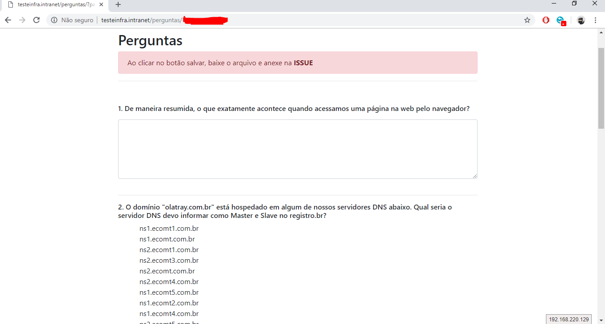

Criar um servidor Web Linux com Nginx+PHP no Ubuntu Server 18 e rodar o código no link https://github.com/luishscosta/teste-devops, que deve ter o seguinte resultado:

# Requisitos

- IP Fixo Configurado, sem DHCP
- Criar Usuário Própio no Linux
  - Usuário root não deve conseguir logar diretamente
- Acesso via terminal remoto (Shell)
- Servidor Web NGinx + PHP 
- Código PHP instalado
- Acessar a URL http://**seudominioouip**/perguntas

## Resultados esperado

- Arquivos de resposta gerado pela aplicação de percentages 
- Documentação simples
    - Lista de comando executados
    - Software e versões instaladas 
- Script com instalação e configuração do servidor na linguagem/ferramenta de sua preferência (Opional)
  - Este script será executado em uma maquina Ubuntu Server 18 e a unica interação humana será o comando `sh instalar.sh`
- Referências utilizadas
- Enviar todos itens acima para um repositório do GitHub e nos responder o e-mail da prova com o Link
